<p align="center">
  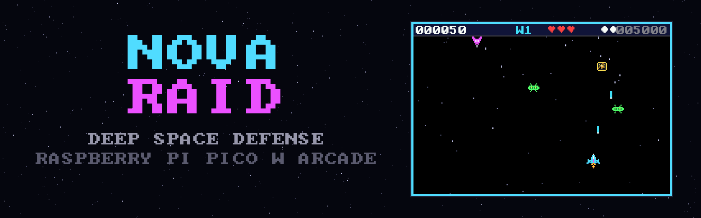
</p>

<h1 align="center">NOVA RAID</h1>

<p align="center">
  A complete retro arcade space shooter for the <b>Raspberry Pi Pico W</b> on the
  <b>52Pi Pico Breadboard Kit Plus (EP-0172)</b> — bare-metal C, dual-core renderer,
  analog joystick control, buzzer sound, WS2812 light feedback, and flash-persistent
  high scores. Drag one UF2 onto the board and play.
</p>

<p align="center">
  <a href="#quick-start">Quick start</a> ·
  <a href="#gameplay">Gameplay</a> ·
  <a href="#hardware">Hardware</a> ·
  <a href="#building-from-source">Building</a> ·
  <a href="docs/architecture.md">Architecture</a> ·
  <a href="docs/troubleshooting.md">Troubleshooting</a>
</p>

---

## Gallery

| Splash | Menu | Gameplay |
|---|---|---|
| 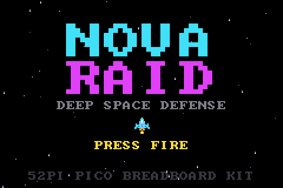 | 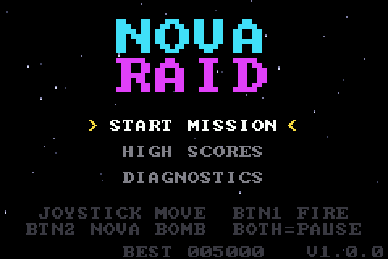 | 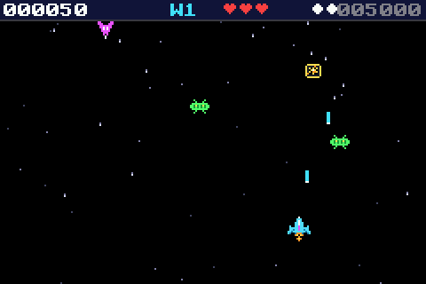 |

| Boss warning | Boss fight | Pause |
|---|---|---|
| 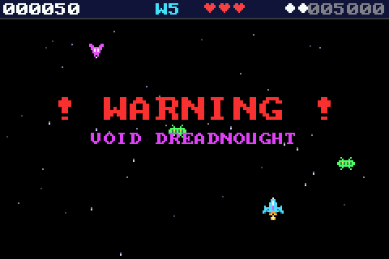 | 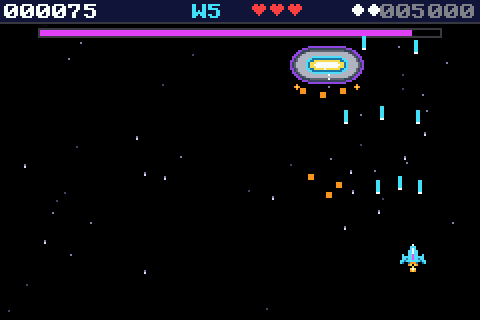 | 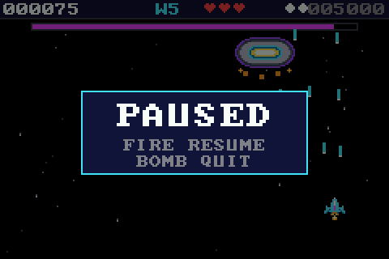 |

| Game over | Initials entry | Hall of fame | Diagnostics |
|---|---|---|---|
| 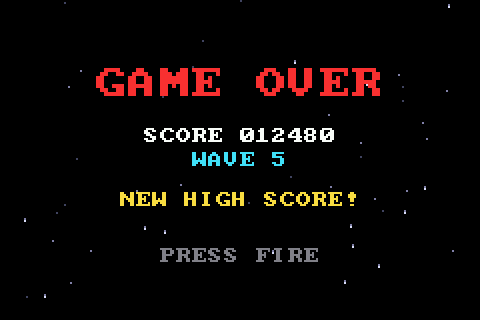 | 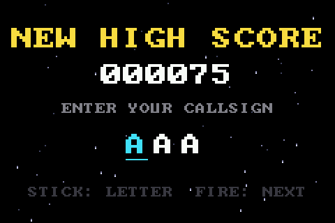 | 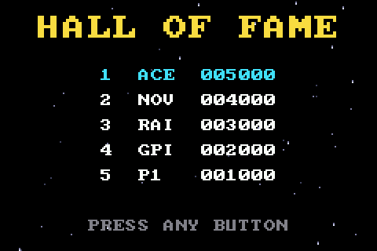 | 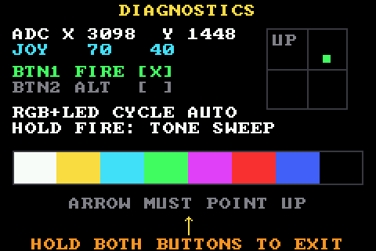 |

> These are real frames rendered by the game code itself, captured through the
> repository's [host harness](tools/host) (`tools/host/capture`), shown at the
> 2× scale the panel displays. They are not photographs of the running board.

## Hardware photos

Owner-supplied photos of NOVA RAID running on the EP-0172 kit:

| Splash | Menu | Gameplay |
|---|---|---|
| 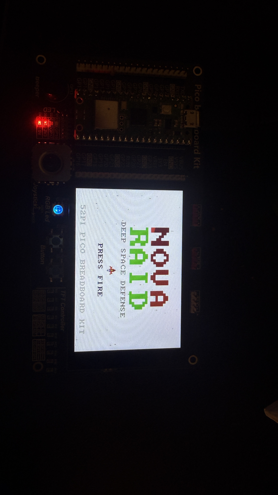 | 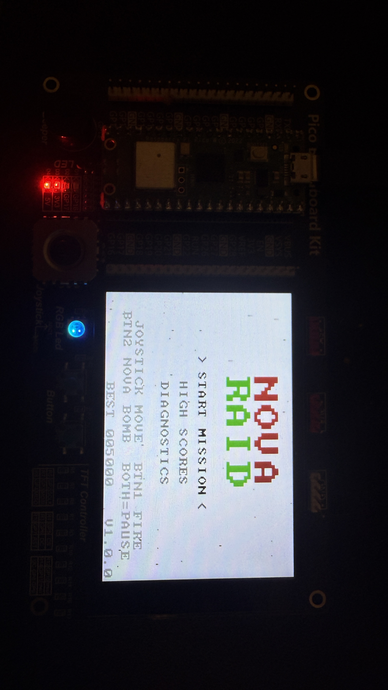 | 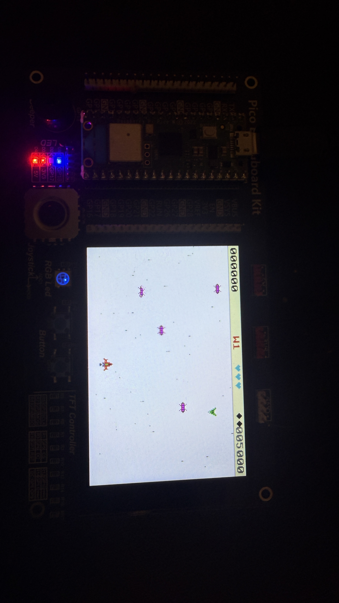 |

| Hall of fame | Diagnostics |
|---|---|
| 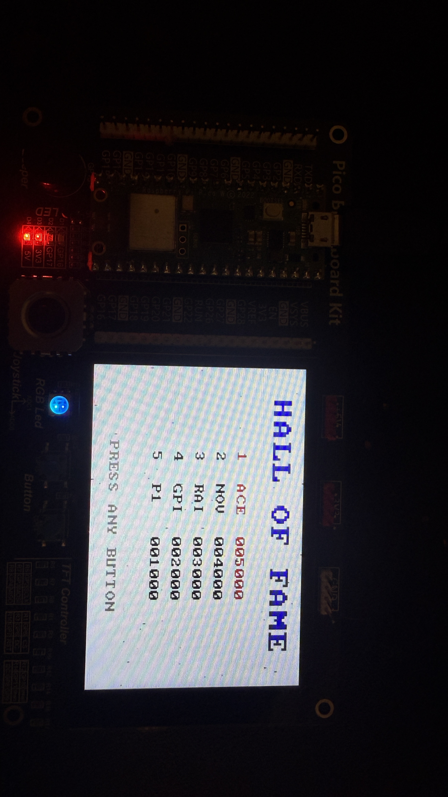 | 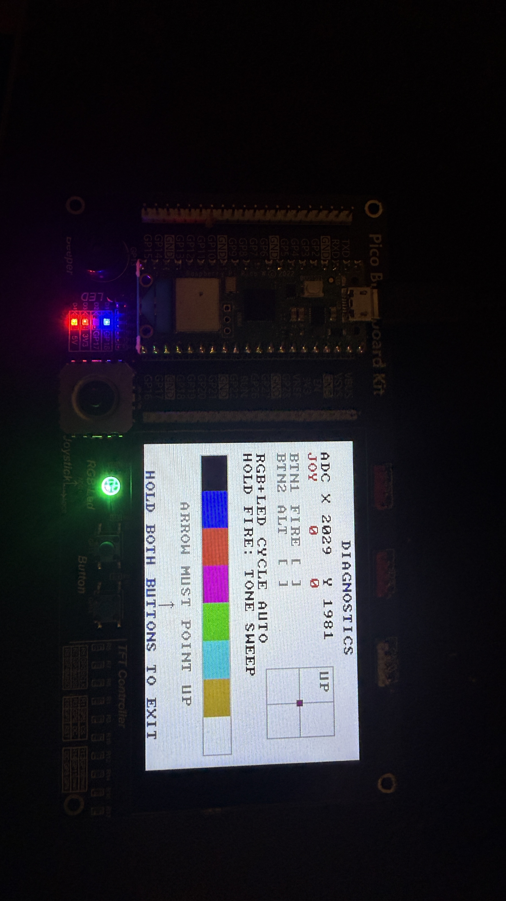 |

## Gameplay

You pilot the last interceptor of the outer colonies against the Void armada.
Survive escalating waves, collect salvage from destroyed enemies, and break the
**Void Dreadnought** blockade that arrives every fifth wave.

- **Four enemy behaviours** — swaying drones, player-locking darters, firing
  sentries, and splitting asteroids, with speed/durability/fire-rate scaling
  every wave.
- **Boss encounters** — a three-phase dreadnought (sweeping spreads → drone
  escorts → radial barrages) with a health bar and phase transitions; boss HP
  grows each visit.
- **Nova bombs** — a limited screen-clearing weapon on the second button; one
  is restocked for each boss kill.
- **Power-ups** — spread shot, rapid fire, shield, extra bomb, and a rare
  extra life.
- **Combo scoring** — chained kills raise a ×2…×5 multiplier shown in the HUD.
- **Hall of fame** — top-5 scores with 3-letter callsigns, stored in the last
  flash sector and preserved across power cycles and reflashes.
- **Full feedback** — buzzer sound effects and jingles, WS2812 status/event
  lighting, panel LEDs for bomb-ready and low-health, hit flashes, sparks and
  explosion animations.
- **Complete game shell** — splash, menu, pause, game over, initials entry,
  high-score table, and a hardware diagnostics screen. Every state is reachable
  and exits cleanly.

### Controls

<p align="center">
  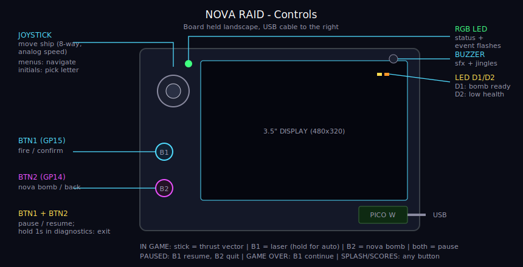
</p>

| Input | In game | In menus |
|---|---|---|
| Joystick | Move ship (analog, 8-way) | Navigate / pick letter |
| BTN1 (GP15) | Fire (hold for autofire) | Confirm |
| BTN2 (GP14) | Nova bomb | Back / cursor left |
| BTN1 + BTN2 | Pause / resume | Hold 1 s to exit diagnostics |

## Quick start

You need: the EP-0172 kit with a Pico W seated in it, and a micro-USB data cable.

1. Download `nova_raid.uf2` from the
   [latest release](../../releases/latest).
2. Hold the **BOOTSEL** button on the Pico while plugging the USB cable into
   your computer. A drive named `RPI-RP2` appears.
3. Drag `nova_raid.uf2` onto that drive. The Pico reboots into the game.
4. You should see the NOVA RAID splash screen. Press **BTN1** to play.

First-run check: open **DIAGNOSTICS** from the menu — it live-displays the
joystick ADC values, button states, display colour bars and an orientation
arrow, cycles the RGB LED and panel LEDs, and plays a tone sweep while BTN1 is
held. If the stick or screen orientation is wrong for your board revision, see
[docs/hardware.md](docs/hardware.md#configurable-assumptions) — every
assumption is a one-line change in [`src/config.h`](src/config.h).

## Hardware

<p align="center">
  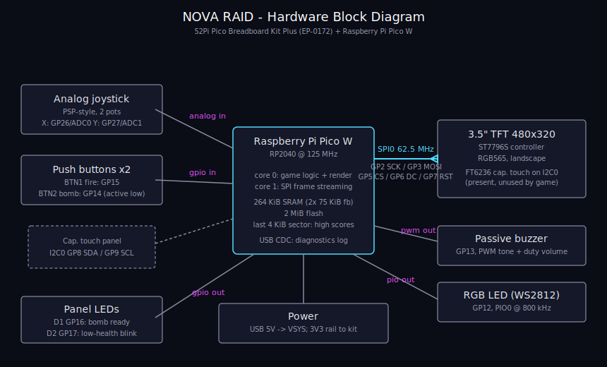
</p>

The target board was identified from the project owner's supplied photograph
(the reference image for this project) as a **52Pi/GeeekPi Pico Breadboard Kit
Plus (EP-0172)** carrying a **Raspberry Pi Pico W**. Identification evidence,
the full pin map, and a logical schematic are in
[docs/hardware.md](docs/hardware.md).

| Peripheral | Pins | Interface |
|---|---|---|
| 3.5" TFT 480×320 (ST7796S) | GP2 SCK, GP3 MOSI, GP4 MISO, GP5 CS, GP6 DC, GP7 RST | SPI0 @ 62.5 MHz |
| Capacitive touch (unused) | GP8 SDA, GP9 SCL | I2C0 |
| Joystick X / Y | GP26 / GP27 | ADC0 / ADC1 |
| BTN1 / BTN2 | GP15 / GP14 | GPIO, active-low |
| Buzzer | GP13 | PWM |
| RGB LED (WS2812) | GP12 | PIO0 |
| Panel LEDs D1 / D2 | GP16 / GP17 | GPIO |

No wiring is required — everything is on the kit. Power comes from the Pico's
USB port. The firmware drives 3.3 V logic only.

## Engineering highlights

- **Dual-core pipeline** — core 0 simulates and renders a 240×160 RGB565
  framebuffer at a fixed 25 fps timestep; core 1 pixel-doubles each line to
  480×320 and streams it over SPI with double-buffered DMA. The ~39 ms panel
  transfer overlaps the next frame's simulation instead of blocking it.
- **No FPU, no problem** — all movement uses 24.8 fixed-point math; sine
  motion comes from a 64-entry table.
- **Safe flash persistence** — high scores live in the last 4 KiB sector,
  written with the second core locked out and IRQs disabled, detected by magic
  number on first boot.
- **Portable game core** — the gameplay code touches hardware only through a
  small [HAL interface](src/hal/hal.h), so the identical sources compile on a
  desktop for automated frame capture ([tools/host](tools/host)) — that's how
  every screenshot above was produced and how CI exercises game logic.
- **Single-channel audio sequencer** with priorities, and an event/base-layer
  WS2812 effect engine.

Full write-up: [docs/architecture.md](docs/architecture.md).

## Building from source

Prerequisites: CMake ≥ 3.13, Ninja (or Make), the Arm GNU toolchain
(`arm-none-eabi-gcc` with newlib), Python 3, and the
[Pico SDK](https://github.com/raspberrypi/pico-sdk) (tested with **2.1.1**).
Step-by-step instructions for Windows, macOS and Linux, including flashing
options and the first-run verification procedure, are in
[docs/build-and-flash.md](docs/build-and-flash.md).

```sh
git clone https://github.com/raspberrypi/pico-sdk --branch 2.1.1 --depth 1
git -C pico-sdk submodule update --init --depth 1 lib/tinyusb
export PICO_SDK_PATH=$PWD/pico-sdk

git clone https://github.com/lla7wel/nova-raid
cmake -S nova-raid -B nova-raid/build -G Ninja -DCMAKE_BUILD_TYPE=Release
ninja -C nova-raid/build          # produces build/nova_raid.uf2
```

`PICO_BOARD` defaults to `pico_w` (the board in the reference photo); pass
`-DPICO_BOARD=pico` for a non-wireless Pico — the game uses no radio features.

## Repository structure

```
├── src/
│   ├── config.h          every pin, timing and tuning constant in one place
│   ├── main.c            dual-core frame pipeline
│   ├── hal/              Pico-specific drivers (ST7796 SPI+DMA, ADC input,
│   │                     PWM buzzer, WS2812 PIO, flash storage)
│   ├── gfx/              framebuffer primitives, 8x8 font, generated sprites
│   └── game/             platform-independent game core (states, entities,
│                         waves, boss, audio sequencer, LED effects)
├── tools/
│   ├── gen_sprites.py    ASCII-art sprite sources -> src/gfx/sprites.c
│   ├── gen_banner.py     README banner / social preview generator
│   └── host/             desktop build of the game core + frame capture
├── docs/
│   ├── hardware.md       board identification, pin map, assumptions
│   ├── architecture.md   system & game architecture (diagrams)
│   ├── build-and-flash.md
│   ├── troubleshooting.md
│   ├── diagrams/         editable SVG sources for all diagrams
│   └── images/           captured frames, hardware photos, banner
└── .github/workflows/    CI: firmware build + host-harness run on every push
```

## Testing and validation

Continuous integration builds the firmware UF2 with the Pico SDK and compiles
and runs the host harness (which drives the game through every state —
splash → menu → waves → boss → pause → death → initials → hall of fame →
diagnostics) on every push. Details and the honest scope of what was and
wasn't physically verified: [docs/build-and-flash.md](docs/build-and-flash.md#validation).

**Physical-hardware note:** this firmware was developed and validated against
documentation, the vendor demo sources, and the host harness — it has not been
run on a physical EP-0172 by the author. The diagnostics screen exists to make
on-device verification a two-minute job; if anything is off, it is expected to
be one of the flagged one-line settings in `src/config.h`.

## Known limitations

- 25 fps cap: a full 480×320×16-bit frame takes ~39 ms at the panel's 62.5 MHz
  SPI limit; the renderer is designed around that budget.
- Single-channel audio: the buzzer plays one voice; simultaneous effects are
  resolved by priority.
- The capacitive touch panel is intentionally unused.
- Joystick axis orientation and panel rotation on other board lots may need
  the documented one-line config flips.

## Roadmap

- Second fire pattern (charge shot) on long BTN1 hold
- Attract-mode demo loop on the splash screen
- Optional CRT-style scanline shading
- Per-wave background palettes

## License and credits

Code and original assets are released under the [MIT License](LICENSE).

- [Raspberry Pi Pico SDK](https://github.com/raspberrypi/pico-sdk) (BSD-3-Clause)
- `ws2812.pio` from [pico-examples](https://github.com/raspberrypi/pico-examples) (BSD-3-Clause, header retained)
- 8×8 font by Daniel Hepper / Marcel Sondaar, [font8x8](https://github.com/dhepper/font8x8) (public domain)
- Board documentation: [52Pi wiki EP-0172](https://wiki.52pi.com/index.php?title=EP-0172) and the
  [GeeekPi kit demo sources](https://github.com/geeekpi/pico_breadboard_kit)
- Hardware reference photograph supplied by the project owner.

All game code, sprite art, sound sequences and diagrams are original to this
project.
