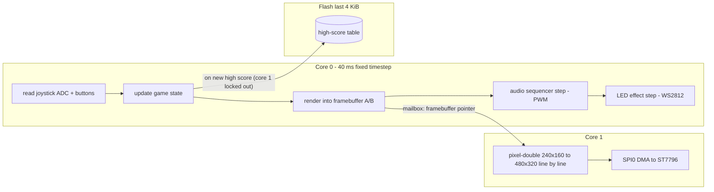
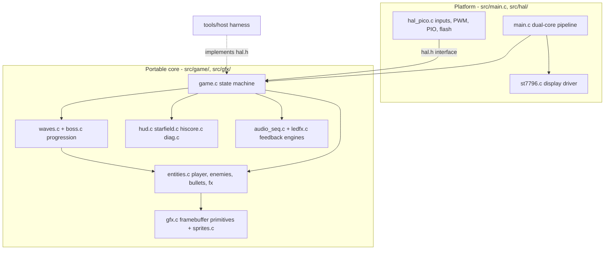
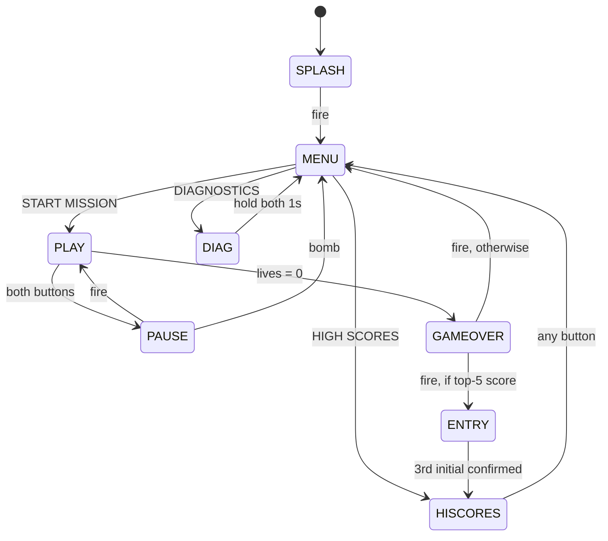

# Architecture

## System overview

The RP2040's two cores split the work so the slow part — pushing 307 KB of
pixels through SPI every frame — never blocks the game:

- The framebuffer is 240×160 RGB565 (75 KB). Two of them allow core 0 to
  render frame *n+1* while core 1 streams frame *n*.
- Core 1 expands each row into a 480-pixel line (byte-swapped for the panel)
  in one of two line buffers, sends it twice via DMA for vertical doubling,
  and prepares the next row while the second copy is on the wire.
- A full frame transfer takes ≈39 ms at 62.5 MHz SPI, which sets the 25 fps
  cadence. Core 0's simulate+render takes a fraction of that, so the pipeline
  is display-bound and the pacing is stable.
- The frame handoff is a plain mailbox variable, **not** the inter-core FIFO,
  because the SDK's `multicore_lockout` (used while writing the high-score
  sector) owns the FIFO.

## Module layout

Everything under `src/game/` and `src/gfx/` includes only `hal/hal.h` and
`gfx/gfx.h` — no Pico headers. `tools/host/hal_host.c` provides a scripted
implementation of the same interface, which is how CI runs the complete game
loop on a desktop and how the README screenshots are captured from the real
game code.

## Game state machine

`game_enter()` centralises transitions (jingles, LED base modes, panel-LED
cleanup), so no state can leak effects into another.

## Wave progression

- Non-boss waves spawn `6 + 2×wave` enemies (cap 26) through one of four
  entry patterns (random, columns, V-formation, flanks), with spawn cadence,
  enemy speed (`+6 %/wave`, cap ×2.2), sentry fire rate and asteroid HP all
  scaling with the wave number.
- Enemy mix shifts with progression: drones dominate early; darters, sentries
  (wave ≥ 2) and asteroids (wave ≥ 3) take over later.
- Every 5th wave is the **Void Dreadnought** (see `boss.c`): HP `60 + 30` per
  prior boss kill, three behaviour phases keyed to remaining HP, and a bomb
  restock + score bonus on defeat.

## Rendering and assets

- All colours are native RGB565; byte-swapping for the panel happens once in
  core 1's scale loop.
- Sprites are palette-indexed byte arrays generated from ASCII pixel art by
  `tools/gen_sprites.py` (index 0 = transparent); text uses the public-domain
  8×8 font. Hit feedback tints a sprite's opaque pixels white for a few
  frames.
- Fixed-point 24.8 math everywhere (`FP()` / `FP_INT()`); the RP2040 has no
  FPU and soft-float in the hot path would not hold the frame budget.

## Audio and lighting

- `audio_seq.c`: one PWM channel, table-driven note sequences with a priority
  byte — a laser blip never cuts off an explosion, jingles outrank everything.
  Volume is approximated by narrowing PWM duty.
- `ledfx.c`: the WS2812 shows a persistent base layer (menu breathing, boss
  pulse, game-over fade, victory hue rotation) with transient event overlays
  (damage red, power-up green, shield blue, bomb white) that decay back to the
  base. Panel LED D1 mirrors bomb availability; D2 blinks on the last life.

## Persistence format

Last 4 KiB flash sector, one 256-byte page:

| Offset | Size | Content |
|---|---|---|
| 0 | 4 | magic `0x4E525631` ("NRV1") |
| 4 | 60 | 5 × { 4-byte callsign, 4-byte score } table |

Blank or foreign flash fails the magic check and the firmware falls back to
built-in defaults — first boot needs no preparation, and reflashing the game
never erases scores (the firmware image ends ~1.9 MB below the score sector).
